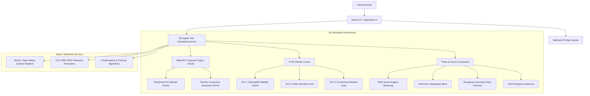

# CCG Engine — Coverage-Combustibility Gap
### Autonomous Wildfire Defense, Spatial Decision Support & 3D Digital Twin Platform

[](https://www.typescriptlang.org/)
[](https://react.dev/)
[](https://threejs.org/)
[](https://developer.mozilla.org/en-US/docs/Web/API/WebGPU_API)
[](https://vitejs.dev/)
[](https://tailwindcss.com/)

---

## 1. Executive Summary

The **CCG Engine (Coverage-Combustibility Gap Engine)** is a high-performance geospatial intelligence platform engineered to identify, simulate, and mitigate structural deficits in wildfire defense across the United States.

By synthesizing satellite-derived environmental data with municipal emergency response infrastructure, the CCG Engine calculates the critical **Coverage-Combustibility Gap**—the delta between an area's physical susceptibility to catastrophic ignition and the fire service's operational capability to intervene in time.

```
                          ┌──────────────────────────┐
                          │     Ignition Potential   │
                          │        Score (IPS)       │
                          └────────────┬─────────────┘
                                       │
                                       ▼
 ┌──────────────────────┐      ┌───────────────┐      ┌──────────────────────────┐
 │ Remote Sensing Data  │ ───► │  CCG Engine   │ ◄─── │ USFA & Dispatch Telemetry│
 │ (NDVI, Slope, Canopy)│      │  H3 Analysis  │      │ (Drive-Times, Stations)  │
 └──────────────────────┘      └───────┬───────┘      └──────────────────────────┘
                                       │
                                       ▼
                          ┌──────────────────────────┐
                          │   Response Capability    │
                          │        Score (RCS)       │
                          └──────────────────────────┘
```

---

## 2. Core Mathematical Formulation

For any spatial cell $i$ (indexed using Uber H3 hexagonal discrete global grid systems):

$$CCG_i = \text{Clamp}\Big(\frac{IPS_i - RCS_i + 1}{2},\; 0,\; 1\Big)$$

Where:
* **$IPS_i$ (Ignition Potential Score)**: Combines canopy bulk density, vegetative moisture index (NDVI), topographical slope gradients, and historical fuel dryness:
  $$IPS_i = w_{\text{canopy}} \cdot C_i + w_{\text{slope}} \cdot S_i + w_{\text{dry}} \cdot (1 - \text{NDVI}_i)$$
* **$RCS_i$ (Response Capability Score)**: Evaluates the nearest staffed fire suppression apparatus using real-world road networks and geocoded drive-time decay functions:
  $$RCS_i = \exp\Big(-\lambda \cdot t_{\text{drive}}(i, \text{Station}_{\text{nearest}})\Big)$$
* **$CCG_i \in [0, 1]$**:
  * **Severe Gap ($\ge 0.75$)**: Critical structural hazard; high combustibility coupled with extended emergency response latency.
  * **High Gap ($0.50 - 0.74$)**: Significant vulnerability requiring targeted resource pre-positioning.
  * **Elevated / Moderate ($< 0.50$)**: Balanced coverage or low native fuel hazard.

---

## 3. Key Capabilities

### 🌐 1. 50-State National Spatial Index
- Seamless interactive national vector map allowing instant inspection of any US state and wildfire risk zones.
- Pre-cached spatial clusters for historical wildfire epicenters (Boulder County CO, Santa Barbara CA, Los Angeles CA, San Diego CA, etc.).

### 🏔️ 2. Photorealistic 3D Digital Twin
- **Satellite Draped Topography**: Real-time high-resolution aerial imagery streamed from **ESRI World Imagery** draped over harmonic mountain elevation geometry.
- **Geodetic East-North-Up (ENU) Tangent Plane**: Mathematical rotation matrix (`getECEFtoLocalMatrix`) guaranteeing that Local $+X$ is strictly East and Local $-Z$ is strictly North, eliminating 90-degree disorientation artifacts across all longitudes.
- **Volumetric Risk Prisms**: Holographic hexagonal columns sitting accurately on mountain slopes with glowing neon edge illumination and risk-gradient fills.
- **Google Photorealistic 3D Tiles**: Integrated client support for streaming 3D mesh photogrammetry via the Google Map Tiles API.

### ⚡ 3. WebGPU Native WGSL Compute Acceleration
- **Parallel Rothermel Fire Propagation**: Native WGSL compute shader executing parallel cellular fire propagation across grid cells in GPU workgroups with sub-millisecond latency ($<0.5\text{ms}$).
- **3D Convective Plume Dynamics**: GPU particle physics simulating physical thermal updraft buoyancy, boundary-layer wind advection, and 3D curl turbulence.
- **Live Hardware Telemetry**: Active reporting of GPU adapter vendor, architecture (e.g., *NVIDIA Ada Lovelace*), and compute dispatch latency.
- **WebGL 2.0 Fallback**: Graceful and transparent cascading fallback for clients without WebGPU support.

### 💾 4. Multi-Tiered 3D Render Caching System
- **Tier 1 (IndexedDB Binary Cache)**: Offline storage of aerial imagery blobs in IndexedDB (`CCG_3D_RenderCache`), enabling sub-5ms instant texture hydration when switching counties.
- **Tier 2 (Geometry Memory Pool)**: LRU memory cache pool reusing complex terrain topography meshes.
- **Tier 3 (On-Demand Dirty-Flag Controller)**: Minimizes idle GPU power consumption by pausing render passes when the camera and simulation are static.

### 📡 5. Live Meteorological Integration
- Synchronous polling of real-time surface weather feeds via **NOAA / Open-Meteo**:
  - Ambient Temperature ($^\circ\text{F}$)
  - Relative Humidity ($\%\text{ RH}$)
  - Surface Wind Velocity ($\text{mph}$) and Azimuthal Heading ($0^\circ - 360^\circ$)

---

## 4. Architecture Overview



---

## 5. Quick Start

### Prerequisites
- **Node.js**: `v18.0.0` or higher (recommended: Node 20 LTS)
- **Browser**: Modern Chromium browser (Chrome 113+, Edge 113+, Brave, Arc) with WebGPU enabled.

### Installation

```bash
# 1. Clone the repository
git clone https://github.com/Cypher193/Mireye.git
cd Mireye/mireye-test

# 2. Install dependencies
npm install

# 3. Launch local development server
npm run dev
```

Open your browser at **`http://localhost:5173/`**.

---

## 6. Project Structure

```
mireye-test/
├── src/
│   ├── components/
│   │   ├── SimulationCanvas.tsx     # 3D WebGPU & Three.js digital twin canvas
│   │   ├── NationalMap.tsx          # 50-State interactive USA vector map
│   │   ├── Header.tsx               # State/County selectors & active telemetry
│   │   ├── MetricCard.tsx           # WUI & CCG metric status panels
│   │   └── HexGrid.tsx              # 2D SVG H3 risk overlay
│   ├── services/
│   │   ├── webGpuCompute.ts         # WGSL compute shaders (fire spread & particles)
│   │   └── renderCache.ts           # IndexedDB & geometry cache pool
│   ├── lib/
│   │   ├── predictiveSim.ts         # Rothermel & FireSenseNet CPU algorithms
│   │   └── mireyeApi.ts             # Mireye environmental platform API client
│   ├── data/
│   │   ├── hexGrid.ts               # H3 cell generators & 50-state geocoding
│   │   ├── historicalFires.ts       # CAL FIRE FRAP historical perimeter data
│   │   └── USAMapPaths.ts           # 50-state SVG boundary path data
│   ├── types.ts                     # Core domain interfaces (HexCell, County)
│   ├── App.tsx                      # Root application state & navigation router
│   └── main.tsx                     # React root mount point
├── public/                          # Static web assets
├── HOW_TO_RUN.md                    # Detailed execution & troubleshooting guide
├── package.json                     # Dependencies & CLI scripts
├── vite.config.ts                   # Vite bundler configuration
└── tsconfig.json                    # TypeScript compiler options
```

---

## 7. Available Scripts

| Script | Purpose |
| :--- | :--- |
| `npm run dev` | Starts Vite hot-reloading development server on port 5173. |
| `npm run build` | Compiles an optimized production build in `dist/`. |
| `npm run preview` | Runs a local web server serving the production `dist/` bundle. |
| `npm run typecheck` | Executes strict TypeScript compilation verification (`tsc --noEmit`). |
| `npm run lint` | Runs ESLint across all TypeScript and React files. |

---

## 8. Environmental Platform & Data Sources

- **Remote Sensing Imagery**: ESRI World Imagery ArcGIS REST API
- **Historical Wildfire Boundaries**: CAL FIRE Fire and Resource Assessment Program (FRAP)
- **Surface Weather Telemetry**: NOAA / Open-Meteo High-Resolution Rapid Refresh (HRRR)
- **Fire Station Geocoding**: United States Fire Administration (USFA) National Fire Department Registry

---

## 9. License

Distributed under the **MIT License**. See `LICENSE` for more information.
