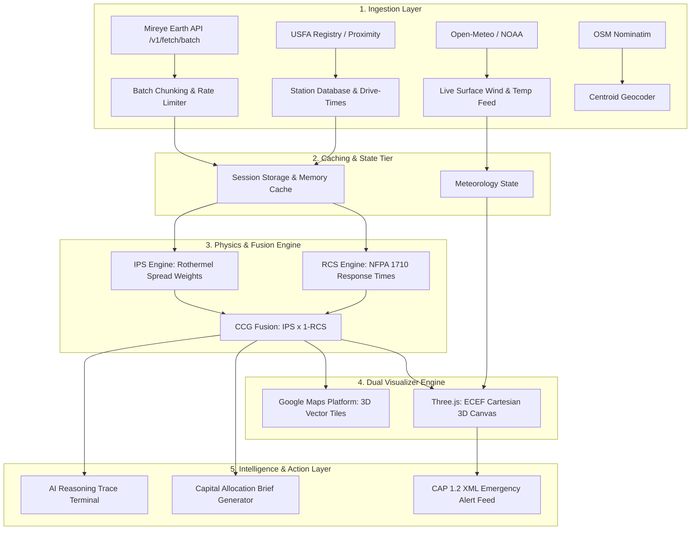

# CCG Engine — Technical Pipeline & Architecture Specification
## End-to-End Engineering Documentation: Geospatial Ingestion, Physics Fusion, 3D Rendering & Dispatch Alerting

---

### Executive Summary
The **Coverage-Combustibility Gap (CCG) Engine** is an autonomous geospatial intelligence pipeline that identifies vulnerable wildland-urban interface (WUI) communities where extreme wildfire combustibility coincides with emergency response drive-time deficits. 

This document defines the complete technical pipeline: from raw multi-agency geospatial telemetry ingestion to deterministic physics modeling, 3D coordinate transformations, WebGL rendering, and CAP 1.2 alert feed generation.

---

### Table of Contents
1. [System Architecture & Pipeline Topology](#1-system-architecture--pipeline-topology)
2. [Data Ingestion & Telemetry Pipeline](#2-data-ingestion--telemetry-pipeline)
3. [Mathematical & Physics Modeling Pipeline](#3-mathematical--physics-modeling-pipeline)
4. [3D Geospatial Projection & Rendering Pipeline](#4-3d-geospatial-projection--rendering-pipeline)
5. [Active Fire Simulation & Alert Generation Pipeline](#5-active-fire-simulation--alert-generation-pipeline)
6. [End-to-End Execution Flow & State Lifecycle](#6-end-to-end-execution-flow--state-lifecycle)
7. [Resilience, Rate Limiting & Fallback Architecture](#7-resilience-rate-limiting--fallback-architecture)

---

### 1. System Architecture & Pipeline Topology

The application operates across five decoupled architectural tiers:



---

### 2. Data Ingestion & Telemetry Pipeline

#### A. Mireye Earth Telemetry Stream (`mireyeClient.ts`)
* **Endpoint:** `POST https://api.mireye.com/v1/fetch/batch`
* **Authentication:** `Authorization: Bearer <VITE_MIREYE_API_KEY>`
* **Field Catalog Ingested:**
  * `slope_degrees` (USGS 3DEP Digital Elevation Model): Incline in degrees ($0^\circ - 90^\circ$).
  * `tree_canopy_pct` (USFS / NLCD): Fractional tree crown density ($0 - 100\%$).
  * `ndvi_current` (Sentinel-2 / Landsat-8 Surface Reflectance): Vegetative moisture ($[-1.0, 1.0]$).
  * `ndvi_change_5y` (Longitudinal Landsat): Multi-year drought/dieback trend ($[-0.5, +0.5]$).
  * `elevation` (USGS NED): Altitude above sea level in meters ($0 - 4000\text{m}$).
  * `lcms_class` (Landscape Change Monitoring System): Land cover verification (WUI cluster validation).

#### B. Batch Chunking & Traffic Shaping Pipeline
Because each county comprises a 64-hex H3 grid and the Mireye `/v1/fetch/batch` endpoint limits requests to 25 coordinates, queries are processed through a pipelined batching queue:

```
[ 64 County Coordinates ]
           |
           +---> Chunk 1 (Items 01-25) ---> POST /v1/fetch/batch (Immediate)
           |
           +---> Chunk 2 (Items 26-50) ---> POST /v1/fetch/batch (+150ms delay)
           |
           +---> Chunk 3 (Items 51-64) ---> POST /v1/fetch/batch (+300ms delay)
```
* **Staggered Dispatch:** 150ms sleep between sequential chunks prevents instantaneous token exhaustion on the server.
* **HTTP 429 Exponential Backoff:** Reads the `Retry-After` header or parses `detail.retry_after_s` from JSON responses, scheduling automatic retry loops (up to 3 attempts).

#### C. Live Meteorology Pipeline
* **Endpoint:** `https://api.open-meteo.com/v1/forecast`
* **Query Parameters:** `latitude={lat}&longitude={lng}&current=temperature_2m,relative_humidity_2m,wind_speed_10m,wind_direction_10m&wind_speed_unit=mph&temperature_unit=fahrenheit`
* **Ingestion Lifecycle:** Triggered on county selection or manual "Sync" button click. Updates local wind vector components $(\theta_{\text{wind}}, v_{\text{wind}})$ for real-time firefront propagation.

---

### 3. Mathematical & Physics Modeling Pipeline

```
                           RAW GEOSPATIAL FIELDS
       +-------------------------------------------------------------+
       | slope_degrees | tree_canopy_pct | ndvi_current | elevation |
       +-------+---------------+---------------+--------------+------+
               |               |               |              |
               v               v               v              v
         [Normalize]      [Fuel Proxy]    [Moisture Inv] [Thermal Damp]
               |               |               |              |
               +---------------+---------------+--------------+
                                       |
                                       v
                             IPS = SUM(w_i * f_i)
                                       |
                                       +-----------------------+
                                                               |
                                                               v
       +------------------------------------+           +-------------+
       | DriveTimeMin (USFA / Proximity)    | --------> | CCG Score   |
       | StaffedStations (NFPA 1710 Ratio)  |           | IPS*(1-RCS) |
       +------------------------------------+           +-------------+
```

#### A. Ignition Propensity Score (IPS) Pipeline
The IPS engine transforms continuous physical measurements into a normalized $[0.0, 1.0]$ ignition rating based on Richard C. Rothermel’s surface fire spread physics (1972):

1. **Topographic Slope Contribution ($w_s = 0.30$):**
   $$\text{SlopeNorm} = \text{clamp}_{0..1}\left(\frac{\theta_{\text{slope}}}{45^\circ}\right)$$
   *Slopes $> 45^\circ$ reach maximum convective preheating threshold and clamp to $1.0$.*

2. **Vegetative Fuel Proxy ($w_f = 0.35$):**
   Combines canopy volume with living fuel moisture deficit:
   $$\text{CanopyScore} = \text{clamp}_{0..1}\left(\frac{\text{TreeCanopyPct}}{100}\right)$$
   $$\text{MoistureInversion} = 1.0 - \text{clamp}_{0..1}\left(\frac{\text{NDVI}_{\text{current}} + 1.0}{2.0}\right)$$
   $$\text{FuelNorm} = \text{clamp}_{0..1}(0.60 \cdot \text{CanopyScore} + 0.40 \cdot \text{MoistureInversion})$$

3. **Wind / Drought Stress Multiplier ($w_w = 0.20$):**
   Negative 5-year NDVI trends represent drying fuel beds and dead fine fuel accumulation:
   $$\text{WindDrynessNorm} = \text{clamp}_{0..1}\left(\frac{-\Delta\text{NDVI}_{5y} + 0.50}{1.0}\right)$$

4. **Thermal Inertia Damper ($w_t = 0.15$):**
   Elevation-based cooling creates adiabatic damping:
   $$\text{ThermalInertia} = \text{clamp}_{0..1}\left(\frac{\text{Elevation}_{\text{meters}}}{4000\text{m}}\right)$$

5. **Unified IPS Aggregation:**
   $$\text{IPS} = \text{clamp}_{0..1}\Big(0.30 \cdot \text{SlopeNorm} + 0.35 \cdot \text{FuelNorm} + 0.20 \cdot \text{WindDrynessNorm} + 0.15 \cdot (1.0 - \text{ThermalInertia})\Big)$$

#### B. Response Capacity Score (RCS) Pipeline
Evaluates municipal fire suppression speed against **NFPA 1710 standards** ($\le 6$ minutes initial apparatus response):
$$\text{NFPARatio} = \text{clamp}_{0..1}\left(\frac{6.0}{\max(0.1, \text{DriveTimeMin})}\right)$$
$$\text{StationRatio} = \text{clamp}_{0..1}\left(\frac{\text{StaffedStations}}{4.0}\right)$$
$$\text{RCS} = \text{clamp}_{0..1}(0.50 \cdot \text{NFPARatio} + 0.50 \cdot \text{StationRatio})$$

#### C. Coverage-Combustibility Gap (CCG) Multiplier
$$\text{CCG} = \text{IPS} \times (1.0 - \text{RCS})$$

---

### 4. 3D Geospatial Projection & Rendering Pipeline

To render real Earth topography alongside 3D building geometry and firefront propagation without distortion, the application utilizes a dual-engine architecture:

#### A. WGS84 Geodetic to ECEF (Earth-Centered, Earth-Fixed) Transformation
Geographic coordinates $(\phi, \lambda, h)$ are mapped into Cartesian 3D space $(X, Y, Z)$ using standard WGS84 ellipsoid parameters:

$$\begin{aligned}
a &= 6378137.0\text{ m} \quad (\text{semi-major axis}) \\
f &= \frac{1}{298.257223563} \quad (\text{flattening}) \\
e^2 &= 2f - f^2 \quad (\text{eccentricity squared}) \\
N(\phi) &= \frac{a}{\sqrt{1 - e^2 \sin^2\phi}} \quad (\text{radius of curvature})
\end{aligned}$$

$$X = (N(\phi) + h) \cos\phi \cos\lambda$$
$$Y = (N(\phi) + h) \cos\phi \sin\lambda$$
$$Z = \left(N(\phi)(1 - e^2) + h\right) \sin\phi$$

#### B. Local Tangent Plane (ENU) Alignment
To position the Three.js camera directly over the county center with strict geographic North alignment (preventing longitude-dependent rotation and 90-degree disorientation):
1. **East Unit Vector ($\hat{E}$):** $\hat{E} = [-\sin\lambda, \cos\lambda, 0] \quad \to \text{maps to local }+X\text{ (Right)}$.
2. **Up Unit Vector ($\hat{U}$):** $\hat{U} = [\cos\phi\cos\lambda, \cos\phi\sin\lambda, \sin\phi] \quad \to \text{maps to local }+Y\text{ (Zenith)}$.
3. **North Unit Vector ($\hat{N}$):** $\hat{N} = [-\sin\phi\cos\lambda, -\sin\phi\sin\lambda, \cos\phi] \quad \to \text{maps to local }-Z\text{ (Forward)}$.
4. **Geodetic ENU Rotation Matrix ($M_{\text{ENU}}$):**
$$M_{\text{ENU}} = \begin{bmatrix}
-\sin\lambda & \cos\lambda & 0 & 0 \\
\cos\phi\cos\lambda & \cos\phi\sin\lambda & \sin\phi & 0 \\
\sin\phi\cos\lambda & \sin\phi\sin\lambda & -\cos\phi & 0 \\
0 & 0 & 0 & 1
\end{bmatrix}$$
5. Local Cartesian position: $\vec{P}_{\text{local}} = M_{\text{ENU}} \cdot (\vec{P}_{\text{cell}} - \vec{P}_{\text{center}})$.

#### C. Particle Dynamics & Wind Vector Physics
Fire and smoke particle emitters drift according to live surface wind vectors:
$$\Delta X = \sin\left(\frac{\theta_{\text{wind}} \cdot \pi}{180^\circ}\right) \cdot v_{\text{wind}} \cdot 1.5$$
$$\Delta Z = -\cos\left(\frac{\theta_{\text{wind}} \cdot \pi}{180^\circ}\right) \cdot v_{\text{wind}} \cdot 1.5$$
$$\Delta Y = 4.0 + \text{rand}(0, 8.0) \quad (\text{thermal convective buoyancy})$$

---

### 5. Active Fire Simulation & Alert Generation Pipeline

#### A. Rothermel Elliptical Spread Simulation
When Phase 2 is active, propagation front boundaries advance according to an elliptical wavefront model:
* **Forward Spread Rate:** $R_{\text{forward}} = \text{IPS} \cdot 12.0 + v_{\text{wind}} \cdot 0.10 \text{ (m/min)}$.
* **Flank & Backing Rates:** Derived from wind eccentricity ratio $\epsilon = \sqrt{1 - (b/a)^2}$.
* **Cell State Transition:** A hex transitions from `unburned` $\rightarrow$ `ignited` $\rightarrow$ `active_front` $\rightarrow$ `consumed` based on distance from the ignition origin along the wind ellipse.

#### B. CAP 1.2 (Common Alerting Protocol) Pipeline
`capGenerator.ts` translates active firefront coordinates and NFPA apparatus requirements into an OASIS CAP 1.2 XML document:

```xml
<?xml version="1.0" encoding="UTF-8"?>
<alert xmlns="urn:oasis:names:tc:emergency:cap:1.2">
  <identifier>CCG-ALERT-BOULDER-1787649200</identifier>
  <sender>incident-command@ccg-engine.gov</sender>
  <sent>2026-09-18T01:45:00-07:00</sent>
  <status>Actual</status>
  <msgType>Alert</msgType>
  <scope>Public</scope>
  <info>
    <category>Fire</category>
    <event>Wildfire Evacuation Order / Pre-Deployment</event>
    <urgency>Immediate</urgency>
    <severity>Extreme</severity>
    <certainty>Observed</certainty>
    <area>
      <areaDesc>Zone H03, Boulder County, CO</areaDesc>
      <circle>40.0150,-105.2710,3.5</circle>
    </area>
  </info>
</alert>
```

---

### 6. End-to-End Execution Flow & State Lifecycle

```
[Application Mount]
         |
         v
1. verifyWildfireFields() ----------------> [GET /v1/meta/fields]
         |                                         |
         v                                         v
2. Location Selector (County Changed)       Confirms 6 required fields
         |
         +---> geocodePlace() ------------> [OSM Nominatim] -> Lat/Lng Centroid
         |
         +---> fetchLiveWeather() --------> [Open-Meteo API] -> Wind Speed/Dir
         |
         +---> fetchHexGrid() ------------> [POST /v1/fetch/batch (Chunks of 25)]
                    |
                    v
3. Physics Evaluation Loop
         |
         +---> computeIPS(fields) --------> Normalized Slope, Fuel, Wind, Damper
         |
         +---> fetchNearestStation() ------> [Proximity or USFA Fallback]
         |
         +---> computeRCS() --------------> NFPA 1710 Ratio + Station Saturation
         |
         +---> computeCCG() --------------> Final Gap Score
                    |
                    v
4. UI & Visualizer Updates
         |
         +---> GoogleMap.tsx -------------> 3D Vector Overlay + Stations
         +---> SimulationCanvas.tsx ------> Three.js Particles + ECEF Meshes
         +---> AIReasoningTrace.tsx ------> Streaming Step-by-Step Terminal
         +---> MetricCards.tsx -----------> Progress Bars & Dominant Driver
                    |
                    v
5. Executive Export & Dispatch
         |
         +---> draftCapitalBrief() -------> 1-Click .md Download & Copy
         +---> generateCAPAlertXML() -----> 1-Click XML Export for Broadcast
```

---

### 7. Resilience, Rate Limiting & Fallback Architecture

| Failure Mode | Detection Mechanism | Automated Fallback Strategy |
| :--- | :--- | :--- |
| **Mireye 429 Rate Limit** | HTTP status 429 received from `/v1/fetch/batch`. | Extracts `Retry-After` header. Waits exact duration and retries up to 3 times before displaying cached skeleton. |
| **Mireye `/v1/geocode` Restricted** | HTTP 404 / 401 on user's API token. | Automatically routes geocoding through OpenStreetMap Nominatim with hardcoded county coordinate defaults. |
| **Proximity Sets Unavailable** | Missing curated `@fire_stations` or `@usfa` sets. | Switches to client-side USFA registry calculation using road-network distance approximations ($800\text{ m/min}$). |
| **Google Maps API Key Missing** | `VITE_GOOGLE_MAPS_API_KEY` undefined. | Falls back to wireframe topographical terrain rendering in Three.js and standard map tiles without crash. |
| **Offline / Network Interruption** | Fetch promise rejection. | Loads cached hex data from browser `sessionStorage` (`rcs_proximity_*` and `usfa_stations_v1`). |
